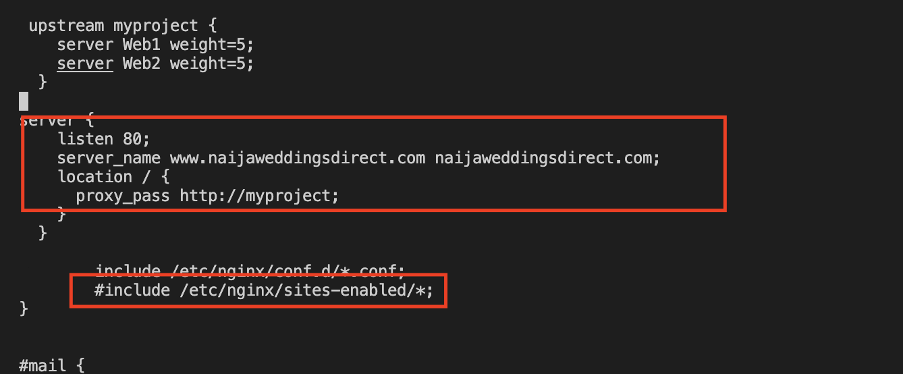

## LOAD BALANCER SOLUTION WITH NGINX AND SSL/TLS

### Task:

This project consists of two parts:

1. Configure Nginx as a Load Balancer
2. Register a new domain name and configure secured connection using SSL/TLS certificates

Your target architecture will look like this:

### CONFIGURE NGINX AS A LOAD BALANCER

You can either uninstall Apache from the existing Load Balancer server, or create a fresh installation of Linux for Nginx.

1. Create an EC2 VM based on Ubuntu Server 20.04 LTS and name it `Nginx LB` (do not forget to open TCP port 80 for HTTP connections, also open TCP port 443 – this port is used for secured HTTPS connections)

2. Update `/etc/hosts` file for local DNS with Web Servers’ names (e.g. Web1 and Web2) and their local IP addresses

- Do this by opening up the hosts file with the code below and updating with both the private IP addresses of the two webservers:

`sudo vi /etc/hosts`

3. Install and configure Nginx as a load balancer to point traffic to the resolvable DNS names of the webservers with the following steps:

- Update the instance and Install Nginx

`sudo apt update`

`sudo apt install nginx`

- Configure Nginx LB using Web Servers’ names defined in `/etc/hosts`

Open the default nginx configuration file

`sudo vi /etc/nginx/nginx.conf`

DO NOT FORGET TO COMMENT OUT THE LINE IN THE CODE:

`include /etc/nginx/sites-enabled/*;`

- Restart Nginx and make sure the service is up and running by running the code below:

`sudo systemctl restart nginx`

`sudo systemctl status nginx`

### REGISTER A NEW DOMAIN NAME AND CONFIGURE SECURED CONNECTION USING SSL/TLS CERTIFICATES

- Create a domain using any of the common website domain providers

- Go to aws console and search for `route 53` and select `create hosted zone`. The Type is `public hosted zone` and then click `create hosted zone`

- To ensure your domain is connected to the aws web53, you will have to copy the nameservers given on web53 below to the nameserver section of your newly created domain:

Below is where the nameservers have to be pasted on the newly created domain:

The next step is to create a record for the domain name on route 53. clicke on `create record`

- Now paste the public IP address of the Nginx-load-balancer instance into the `values` section of the new record being created & click create (everything else can stay as default)

Note that we are using the public IP address as we will get charged if we use otherwise.

-  Create another record with name as `www` and also reference the public IP address of the NGINX-load-balancer as per below:

With the steps taken above, the load balancer, the route 53 and the newly created domain name have all been connected together. 

Check that your Web Servers can be reached from your browser using new domain name using HTTP protocol – http://<your-domain-name.com>. If successful, it means the Nginx load balancer is working okay

This result was achieved in below snapshot:

- Configure Nginx to recognize your new domain name by doing the following:

Update your `nginx.conf` with server_name www.<your-domain-name.com> instead of `server_name www.domain.com`. (you make two entries separated by a space. One entry has www. and the other doesnt for your newly created domain) 

Enter the code:

`sudo vi /etc/nginx/nginx.conf`

The change is made to the previously pasted configuration from above in the `http` section of the config file. 

 ## The next steps are for installing the SSL/TLS cetificates

- Install certbot and request for an SSL/TLS certificate
(first ensure `snapd` service is running by running the code: 

`sudo systemctl status snapd`

Install certbot

`sudo snap install --classic certbot`

Request your certificate (just follow the certbot instructions – you will need to choose which domain you want your certificate to be issued for, domain name will be looked up from nginx.conf file so make sure you have updated it on step 4).

`sudo ln -s /snap/bin/certbot /usr/bin/certbot`

`sudo certbot --nginx`

Following the steps above will help to get a secure certificate for your newly created domain website so ensure that the nginx.conf file is updated with the correct domain name 

Below snapshots shows the certificate was successfully acquired:

Test secured access to your Web Solution by trying to reach https://<your-domain-name.com> (ie, refreshing the website in the browser show show the sercurity padlock and certficate as per below:)

You shall be able to access your website by using HTTPS protocol (that uses TCP port 443) and see a padlock pictogram in your browser’s search string.
Click on the padlock icon and you can see the details of the certificate issued for your website.

- Set up periodical renewal of your SSL/TLS certificate

By default, LetsEncrypt certificate is valid for 90 days, so it is recommended to renew it at least every 60 days or more frequently.

You can test renewal command in `dry-run` mode

`sudo certbot renew --dry-run`

Best pracice is to have a scheduled job that to run renew command periodically. Let us configure a `cronjob` to run the command twice a day.

To do so, lets edit the `crontab` file with the following command:

`crontab -e`

Add following line:

`* */12 * * *   root /usr/bin/certbot renew > /dev/null 2>&1`

You can always change the interval of this cronjob if twice a day is too often by adjusting schedule expression.

